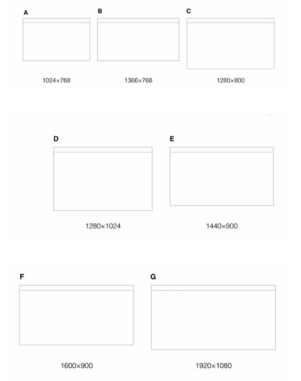

> 前天我看了一篇关于前端必备技术栈，有很多我都不太了解，所以今天整理一下

# 1  HTML
## 1.1  网页常见尺寸



一般网站宽为996px；国内网站大部分还是以1000个像素为界限，因超过1000像素适合在大屏幕上浏览，小屏幕会显得拥挤。国内尺寸设置比较保守，这样可以保证大部分用户舒适的浏览网页。


## 1.2 主流浏览器
```
chrome
IE
firefox
safari
opera
```
知道了浏览器的设计特点才能更好的设计页面，比如浏览器的头部的操作高度和信息的展示都会有所不同，那么页面在每个浏览器上面的展现就会有所不同。


##  1.3  语义化标签
HTML5的革新之一：`语义化标签`一`节元素标签`(`header`,`footer`)、`文本元素标签`(`article`,`aside`,`setion`)、`分组元素标签`(`menu`,`hgroup`,`nav`)。

在HTML5出来之前，我们用`div`来表示页面章节，但是这些`div`都没有实际意义。（即使我们用`css`样式的`id`和`class`形容这块内容的意义）。这些标签只是我们提供给浏览器的指令，只是定义一个网页的某些部分。但现在，那些之前没`意义`的标签因为因为`html5`的出现消失了，这就是我们平时说的`语义`。

但是也不要因为`html5`新标签的出现，而随意用之，错误的使用肯定会事与愿违。所以有些地方还是要用`div`的，就是因为`div`没有任何意义的元素，他只是一个标签，仅仅是用来构建外观和结构。因此是最适合做容器的标签。

`W3C`定义了这些语义标签，不可能完全符合我们有时的设计目标，就像制定出来的法律不可能流传100年都不改变，更何况它才制定没多久，不可能这些语义标签对所以设计目标的适应。只是一定程度上的`通用`，我们的目标是让爬虫读懂重要的东西就够了。

结论：不能因为有了`HTML5`标签就弃用了`div`，每个事物都有它的独有作用的。

## 1.4  SPA
### 1.4.1 WHAT
单页Web应用（`single page web application`，`SPA`），就是只有一张Web页面的应用。单页应用程序 (`SPA`) 是加载单个HTML 页面并在用户与应用程序交互时动态更新该页面的Web应用程序。浏览器一开始会加载必需的`HTML`、`CSS`和`JavaScript`，所有的操作都在这张页面上完成，都由`JavaScript`来控制。因此，对单页应用来说模块化的开发和设计显得相当重要。

### 1.4.2 WHY
- 速度：更好的用户体验，让用户在`web app`感受native app的速度和流畅，
- MVC：经典MVC开发模式，前后端各负其责。
- ajax：重前端，业务逻辑全部在本地操作，数据都需要通过AJAX同步、提交。
- 路由：在URL中采用#号来作为当前视图的地址,改变#号后的参数，页面并不会重载。

`单页Web应用`（`single page web application`，`SPA`）是当今网站开发技术的弄潮儿，很多传统网站都在或者已经转型为`单页Web应用`，新的单页Web应用网站（包括移动平台上的）也如雨后春笋般涌现在人们的面前，如`Gmail`、`Evernote`、`Trello`等。

单页`Web`应用和前端工程师们息息相关，因为主要的变革发生在浏览器端，用到的技术其实还是`HTML`+`CSS`+`JavaScript`，所有的浏览器都原生支持，当然有的浏览器因为具备一些高级特性，从而使得单页`Web`应用的用户体验更上一层楼。

单页`Web`应用，顾名思义，就是只有一张`Web`页面的应用。浏览器一开始会加载必需的`HTML`、`CSS`和`JavaScript`，之后所有的操作都在这张页面上完成，这一切都由`JavaScript`来控制。因此，单页`Web`应用会包含大量的`JavaScript`代码，复杂度可想而知，模块化开发和设计的重要性不言而喻。

### 1.4.3 HOW
- 用循环的视角审视`Web`应用开发
- 框定一个一致的`SPA`图形用户界面（GUI）和模型
- 将`SPA`的原则带回服务器端
- 聚集于对合适的应用进行早期`SPA`开发
- `SPA`协调的起点是认识到`SPA`与脚本和网页编程有关，而不是与后端应用有关。

`SPA`的主要目标是围绕着`Web 2.0`,页面时间交互原则重构`Web`应用，以便体验可容易地转化到多个设备中，并对用户有效。这意味着首先要抱着支持这样一个逻辑活动为目标来设计用户交互，该活动应该涉及单页面与一套脚本，实现一次加载并执行直到活动完成。

一旦用户交互设计完成，下一步就是框定一个本地状态或事件模型，该模型应能描述页面处理与用户的交互及与任何后端应用交互。尽管这并非不可能，但是开发与服务器端功能多组件交互的`SPA`会更加困难。

这会产生一种要对应用服务器进行重构的诱因，其目的是为了以1:1的比例来支持`SPA`。就最大程度上而言，该模型应该让自己的变量及命名空间本地化，并通过应用的服务器端与其他`SPA`交互。这是为了减少对于用本地`SPA`控制器或模型来在多个`SPA`之间保留状态的需求。

# 2 CSS
## 2.1 模块化
### 2.1.1 WHAT
在某度的解释是，在系统的结构中，模块是可组合、分解和更换的单元。模块化是一种处理复杂系统分解成为更好的可管理模块的方式。它可以通过在不同组件设定不同的功能，把一个问题分解成多个小的独立、互相作用的组件，来处理复杂、大型的软件。

模块化，有点像拼图的即视感，可以把大图分成各个小图，然后把小图拼成大图，分与合的艺术感。那么css模块化思想，也就是在css编写环境中，用上模块化的思想，把一个大的项目，分解成独立的组件，不同的组件负责不同的功能，最后把模块组装，就成了我们要完成的项目了。

### 2.1.2 WHY
当做一个大项目，几个人团队合作开发，结果看不懂彼此的代码，怎么办，当面对前人已经写好代码，需要修改，可是无处下手，怎么办.当代码耦合，修改费时费力，怎么办，当需要迭代，面对庞大的代码，牵一发动全身的悲催时刻，怎么办，这个时候，模块化思想就是救星了。css写法特别的灵活，也因为灵活，所以容易耦合在一起，这时候就需要进行模块化的分离。那么css模块化的好处多多，列举了一些如下：
 - 提高代码重用率
 - 提高开发效率、减少沟通成本
 - 提高页面容错
 - 降低耦合
 - 降低发布风险
 - 减少Bug定位时间和Fix成本
 - 更好的实现快速迭代
 - 便于代码维护
 - 包括但不限于以上好处


### 2.1.3 HOW
#### 2.1.3.1 css样式文件名：

```css
/*1）*/
 master.css/*主要的样式*/
 layout.css/*布局，版面的样式*/
 columns.css/*专栏的样式*/
 font.css/*文字的样式*/
 print.css/*打印样式的样式*/
 themes.css/*主题的样式*/
```

```css
/*2）*/
reset.css /*对浏览器的默认样式进行重设*/
layout.css /*管理页面的布局*/
typeset.css /*图文的编排*/
color.css /*统一管理颜色的搭配*/
print.css /*打印效果样式*/
ie.css /*iehacker样式*/
```

```css
/*3）*/
reset.css/*对浏览器的默认样式进行重设*/
header.css /*头部的所有样式*/
container.css /* 除头部/底部外的中间区域样式*/
footer.css /*底部样式*/
print.css /*打印样式*/
ie.css /*iehacker样式*/
```

```css
/*4）*/
reset.css /*页面样式充值*/
header.css /*全站头部样式*/
footer.css /*全站尾部样式*/
public.css /*全站公共模块样式*/
index.css /*首页特有样式*/
container.css /*二级及以下主体样式*/
print.css /*打印样式*/
ie.css /*IE hack*/
```
还是那句话，没有最好的命名方式，只有最合适的命名方式。主要就是从`html`结构和`bug`的快速定位和便于其他成员的修改上去考虑。

假如你的网站是新闻类的门户网站，然后`html`的结构就主要是布局，版面 `layout.css `，专栏 `columns.css` ，文字 `font.css` ，打印样式 `print.css` 就比较适合，因为跟`html`很一致，也很契合。

假如是企业官网的话，一般`html`结构都是头和尾都有标准的，所以与`html`结构最契合的就是第三种了，同时我们可以优化第三种，在`container`里面再分类，分成`common`,`layout`，就方便进一步的修改，至于`common`里就可以放入`font`,`color`一些公用的样式。

没有完美的生活，也没有完美的人，所以也没有完美的文件命名，只有尽量做到与`html`布局契合，然后重在从每次的项目中反省，总结，条条大路通罗马，能抓住老鼠的就是好猫。

#### 2.1.3.2 css选择器相关
规范`css`选择器的命名，是个老生常谈的问题，对它的规范，不仅是模块化实现的一环，便于团队开发，同时也规避了一些兼容性的麻烦。因为各个浏览器，IE，火狐，谷歌，safari，每个浏览器,都会因为命名不规范会产生不同样式。

所有的`CSS`语法是不区分大小写的`ASCII`范围（即，i.e., [a-z] and [A-Z]是等价的）中，除了部分不属于CSS的控制之下。例如，在`HTML`中值的区分大小写属性`ID`的字体名称和`class`，和URI就在于本规范的范围之内。请特别注意，元素名称是不区分大小写的`HTML`，但区分大小写的`XML`。

在`CSS`中，标识符（包括元素名称，类别，并在选择的ID）只能包含字符[A-ZA-Z0-9]和`ISO 10646`字符`U + 00A0`高，加上连字符`（ - ）`和下划线`（ _）`; 他们不能以数字开头，两个连字符，或一个连字符后跟数字。标识符也可以包含转义字符和任何`ISO 10646`字符作为一个数字代码（见下项）。

具体请查看[参考网页](http://www.cnblogs.com/WebShare-hilda/p/4686067.html),例如，识别符`B&W?`可被写为`B \＆W \？`或`B \ 26W¯¯\ 3F`。请参考`W3C CSS2.1`的`4.1.3`节,链接地址：http://www.w3.org/TR/CSS21/syndata.html#characters

选择器的命名在各浏览器下的支持情况有所不同。因此，如果选择器的命名不规范，将影响各浏览器下的渲染效果。为了兼容以上的浏览器，省麻烦，我们尽量命名以字母开头。可以保证都兼容。

#### 2.1.3.3 常用的css命名规则

##### (一) 注释的写法:
```css
/* Header */
内容区
/* End Header */
```

##### (二) id的命名:

###### (1)页面结构

  容器: container

  页头：header

  内容：content/container

  页面主体：main

  页尾：footer

  导航：nav

  侧栏：sidebar

  栏目：column

  页面外围控制整体布局宽度：wrapper

  左右中：left right center

###### (2)导航

  导航：nav

  主导航：mainbav

  子导航：subnav

  顶导航：topnav

  边导航：sidebar

  左导航：leftsidebar

  右导航：rightsidebar

  菜单：menu

  子菜单：submenu

  标题: title

  摘要: summary

###### (3)功能

  标志：logo

  广告：banner

  登陆：login

  登录条：loginbar

  注册：register

  搜索：search

  功能区：shop（如购物车）

  标题：title

  加入：joinus

  状态：status

  按钮：btn

  滚动：scroll

  标签页：tab

  文章列表：list

  提示信息：msg

  当前的: current

  小技巧：tips

  图标: icon

  注释：note

  指南：guide

  服务：service

  热点：hot

  新闻：news

  下载：download

  投票：vote

  合作伙伴：partner

  友情链接：link

  版权：copyright

##### (三) class的命名

###### (1)颜色:使用颜色的名称或者16进制代码,如
```css
.red { color: red; }

.f60 { color: #f60; }

.ff8600 { color: #ff8600; }
```
###### (2)字体大小,直接使用”font+字体大小”作为名称,如
```css
.font10px { font-size: 10px; }

.font6pt {font-size: 6pt; }
```
###### (3)对齐样式,使用对齐目标的英文名称,如
```css
.left { float:left; }

.bottom { float:bottom; }
```
###### (4)标题栏样式,使用”类别+功能”的方式命名,如
```css
.barNews { }

.barProduct { }
```

##### (四) 注意事项
- 尽量用英文;
- 不加中杠和下划线;
- 尽量不缩写；
- class 名称应当尽可能短，并且意义明确。
- 使用有意义的名称。使用有组织的或目的明确的名称，不要使用表现形式（presentational）的名称。
- 基于最近的父 class 或基本（base） class 作为新 class 的前缀。
- 使用 .js-* class 来标识行为（与样式相对），并且不要将这些 class 包含到 CSS 文件中。

##### (五) 选择器
- 对于通用元素使用 class ，这样利于渲染性能的优化。
- 对于经常出现的组件，避免使用属性选择器（例如，[class^="..."]）。浏览器的性能会受到这些因素的影响。
- 选择器要尽可能短，并且尽量限制组成选择器的元素个数，建议不要超过 3 。
- 只有在必要的时候才将 class 限制在最近的父元素内（也就是后代选择器）（例如，不使用带前缀的 class 时 -- 前缀类似于命名空间）。


## 2.2 弹性布局

### 2.2.1 Flexbox
#### 2.2.1.1 WHAT
2009年，W3C提出了一种崭新的方案-Flex布局（即弹性伸缩布局），它可以简便、完整、响应式地实现各种页面布局，包括一直让人很头疼的垂直水平居中也变得很简单地就迎刃而解了。但是这个布局方式还处于W3C的草案阶段，并且它还分为旧版本、新版本以及混合过渡版本三种不同的编码方式。其中混合过渡版本主要是针对IE10做了兼容。目前flex布局用得比较多的还是在移动端的布局。

 #### 2.2.1.1 HOW
下面将通过一个简单的实例来讲解旧版本的各个属性：
```HTML
<div>
    <p>helloOnehelloOnehelloOnehelloOnehelloOnehelloOnehelloOnehelloOnehelloOnehelloOnehelloOnehelloOnehelloOnehelloOnehelloOnehelloOnehelloOnehelloOnehelloOnehelloOne</p>
    <p>helloTwohelloTwohelloTwohelloTwohelloTwohelloTwohelloTwohelloTwohelloTwohelloTwohelloTwohelloTwohelloTwohelloTwohelloTwohelloTwohelloTwohelloTwohelloTwohelloTwohelloTwo</p>
    <p>helloThreehelloThreehelloThreehelloThreehelloThreehelloThreehelloThreehelloThreehelloThreehelloThreehelloThreehelloThreehelloThreehelloThreehelloThreehelloThreehelloThreehelloThree</p>
</div>
```
可以看到我们这个例子是很简单的，一个div元素内包含三个p元素，它们都是块元素（block）。接下来给段落加一些基础的样式，然后p标签会在页面上垂直成三行进行展示
```css
p{
    width:150px;
    border:3px solid lightblue;
    background:lightgreen;
    padding:5px;
    margin:5px;
}
```
给div添加以样式
```css
div{
    display:-webkit-box;
    display:box;
}
```
现在每一个p元素都变成一个box了，这就是弹性布局的神奇所在！

在上面中，我们将div元素的display设置为box，这就是旧版本的弹性布局。对于比较旧的浏览器版本，我们需要加上-webkit-前缀。

旧版本的弹性布局有两个属性值：

box : 将容器盒模型作为块级弹性伸缩盒显示
inline-box : 将容器盒模型作为内联级弹性伸缩盒显示

PS：我们知道块级它是占用整行的，比如div元素；而内联级不占用整行，比如span元素。但是我们设置了整个盒子，他们都不占用，保持一致。就像我们上面的例子一样，给div元素设置了盒子，那么div元素里面的p元素就不占用了。

#### 2.2.1.2 PROP
> ##### (一) `box-orient 属性`
box-orient属性主要实现盒子内部元素的流动方向。
```
horizontal ： 伸缩项目从左到右水平排列
vertical  ： 伸缩项目从上到下垂直排列
inline-axis ： 伸缩项目沿着内联轴排列显示
block-axis ： 伸缩项目沿着块轴排列显示
```
大家不妨试一下：`horizontal` 和 `inline-axis` 都是水平排列，而`vertical` 和 `block-axis` 都是垂直排列。
```css
div{
      display:-webkit-box;
      display:box;
      -webkit-box-orient:vertical;
      box-orient:vertical;
  }
```

> ##### (二) `box-direction属性`
box-direction 属性主要是设置伸缩容器中的流动顺序。
```
normal  : 正常顺序，默认值
reverse : 反序
```
下例是反序显示的例子
```css
div{
    display:-webkit-box;
    display:box;
    -webkit-box-direction:reverse;
    box-direction:reverse;
}
```

> ##### (三) `box-pack属性`
box-pack 属性用于伸缩项目的分布方式。
```
start   :  伸缩项目以起始点靠齐
  end   :  伸缩项目以结束点靠齐
center :  伸缩项目以中心点靠齐
justify  :  伸缩项目平局分布
```

以下是让项目整体水平居中的例子
```css
div{
    -webkit-box-pack:center;
    box-pack:center;
}
```

> ##### (四) `box-align属性`
box-align 属性用来处理伸缩容器的额外空间。
```
start  ： 伸缩项目以顶部为基准，清理下部额外空间
end    ： 伸缩项目以底部为基准，清理上部额外空间
center ： 伸缩项目以中部为基准，平均清理上下部额外空间
baseline ： 伸缩项目以基线为基准，清理额外的空间
stretch  ： 伸缩项目填充整个容器，默认值
```

```css
div{
    display:-webkit-box;
    display:box;
    -webkit-box-orient:horizontal;
    box-orient:horizontal;
    -webkit-box-align:baseline;
    box-align:baseline;
}
```

> ##### (五) `box-flex 属性`
可以使用浮点数分配伸缩项目的比例。此属性是给容器内的项目设置的，它们会基于父容器的宽度来分配它们所占的比例

```css
p:nth-child(1){
    -webkit-box-flex:1;
    box-flex:1;
}
p:nth-child(2){
    -webkit-box-flex:3;
    box-flex:3;
}
p:nth-child(3){
    -webkit-box-flex:1;
    box-flex:1;
}
```
当然也可以有些项目是固定宽度的，那么其他的项目也会分配剩余的宽度，比如这里第一个p元素设置为固定宽度：

```css
p:nth-child(2){
    -webkit-box-flex:2;
    box-flex:2;
}
p:nth-child(3){
    -webkit-box-flex:1;
    box-flex:1;
}
```
> ##### (六) `box-ordinal-group 属性`
box-ordinal-group 属性可以设置伸缩项目的显示位置。
```css
p:nth-child(1){
    -webkit-box-ordinal-group:2;
    box-ordinal-group:2;
}
p:nth-child(2){
    -webkit-box-ordinal-group:3;
    box-ordinal-group:3;
}
p:nth-child(3){
    -webkit-box-ordinal-group:1;
    box-ordinal-group:1;
}
```
可以看到：第一个p元素排在了第二，第二个p元素排在了第三，第三个p元素排在了第一。可以单独给某一个p元素设置此属性，其他项目会按照原来的顺序做变动。
```css
div{
    display:-webkit-box;
    display:box;
    height:500px;
    border:1px solid #f00;
    -webkit-box-pack:center;
    box-pack:center;
    -webkit-box-align:center;
    box-align:center;
}
```

### 2.2.2 Flex
#### 2.2.2.1 WHAT
新版本的Flexbox模型是2012年9月提出的工作草案，这个草案是由W3C 推出的最新语法。这个版本立志于指定标准，让新式的浏览器全面兼容，在未来浏览器的更新换代中实现统一。
#### 2.2.2.2 PROP
> ##### (一) `flex-direction属性`
flex-direction属性用于设置伸缩项目的排列方式。
```
row ： 设置从左到右排列
row-reverse ： 设置从右到左排列
column ： 设置从上到下排列
column-reverse ： 设置从下到上排列
```

```css
div{
    display:flex;
    flex-direction:column;
}
```
结果就是容器内的所有项目按照从上到下排列的,当你设置为row-reverse时，效果就是这个是从浏览器的右边往左边排列的。

> ##### (二) `flex-wrap属性`
flex-wrap属性设置项目的换行方式（当容器宽度不足以容纳所有子项目时）。
```
nowrap ： 默认值，都在一行或者一列中显示
wrap ： 伸缩项目无法容纳时，自动换行
wrap-reverse ： 伸缩项目无法容纳时，自动换行，方向和wrap相反
```

```css
div{
    display:flex;
    flex-wrap:wrap;
}
```
可以看到，当把浏览器窗口缩小时，第三个p元素因为容纳不下而被挤下来了。

> ##### (三) `flex-flow属性`
flex-flow 属性是 `flex-direction` 和 `flex-wrap` 属性的速记属性。

```CSS
div{
    display:flex;
    flex-flow:row wrap;
}
```
上面这个例子就相当于设置了`flex-direction`为`row`，`flex-wrap`为`wrap`。

> ##### (四) `justify-content属性`
justify-content 在当灵活容器内的各项没有占用主轴上所有可用的空间时对齐容器内的各项（水平）。
```
flex-start ： 伸缩项目以起始点靠齐
flex-end ： 伸缩项目以结束点靠齐
center ： 伸缩项目以中心点靠齐
space-between ： 伸缩项目平均分布
space-around ： 伸缩项目平均分布，但两端保留一半的空间
```

```css
div{
    display:flex;
    justify-content:space-around;
}
```
可以看到所有项目平均分布，而且两端也有保留一半的空间。

> ##### (五) `align-items属性`
align-items 属性规定灵活容器内的各项的默认对齐方式，和旧版本中的box-align一样，处理伸缩项目容器的额外空间。

```
flex-start ： 伸缩项目以顶部为基准，清理下部的额外空间
flex-end ： 伸缩项目以底部为基准，清理上部的额外空间
center ： 伸缩项目以中部为基准，平均清理上下部的额外空间
baseline ： 伸缩项目以基线为基准，清理额外的空间
stretch ： 伸缩项目填充整个容器，默认值
```

```css
div{
    display:flex;
    align-items:center;
}
```

这些效果跟旧版本的box-align基本是一样的，具体怎么用，大家自己试一下就知道了。

> ##### (六) `align-self属性`
align-self 和align-items 一样，都是清理额外空间，但它是单独设置某一个伸缩项目的。所有的值和align-itmes 一致。
```css
p:nth-child(2){
    align-self:center;
}
```
其他属性值的效果同align-items，这里就不赘述。

> ##### (七) `flex属性`
flex 属性和旧版本中的box-flex 类似，用来控制伸缩容器的比例分配。
```css
p:nth-child(1) {
flex: 1;
}
p:nth-child(2) {
flex: 3;
}
p:nth-child(3) {
flex: 1;
}
```
> ##### (八) `order属性`
order 属性和旧版本的box-ordinal-group 属性一样控制伸缩项目出现的顺序。

```css
p:nth-child(1) {
    order: 2;
}
p:nth-child(2) {
    order: 3;
}
p:nth-child(3) {
    order: 1;
}
```

### 2.2.3 Grid
CSS Grid现在已经被W3C纳入到CSS3的一个布局模块当中，被称为CSS Grid Layout Module。而我们较为熟悉的还是将其想像成网格或者栅格，也就是早期的960gs。

#### 2.2.3.1 WHY

在我们的Web内容中，可以将其分割成很多个内容块，而这些内容块都占据自己的区域(regions)，可以将这些区域想像成是一个虚拟的网格。

到目前为止，在一个模板中使用不同的结构标签，使用多个浮动和手动计算实现一个布局。这对于Web前端人员来说，这是一件痛苦之事。而网格布局将让你摆脱这样的困局，让你的布局方法变得非常简单与清晰。

网格布局给了我们一种方法——创建的结构与使用表格(table)布局并没有什么不同。然而，他是在CSS中实现而不是在HTML中实现，同时还可以依赖于媒体查询根据不同的上下文得新定义布局。

这对于喜欢响应式设计的同学来说是一个绝对利好的消息。因为你不在需要再担心你的HTML结构而影响你的布局。

网格布局还可以让我们摆脱现在布局中存在的文档流限制，换句话说，你的结构不需要根据设计稿从上往上布置了。这也意味着您可以自由地更改页面元素位置。

这最适合你在不同的断点位置实现你最需要的布局，而不再需要为响应你的设计而担心HTML结构的问题。

#### 2.2.3.2 WHAT

`CSS Grid Layout`是`CSS`为布局新增的一个模块。网格布局特性主要是针对于`Web应用程序的开发者`。可以用这个模块实现许多不同的布局。网络布局可以将应用程序分割成不同的空间，或者定义他们的大小、位置以及层级。

就像表格一样，网格布局可以让`Web设计师`根据元素按列或行对齐排列，但他和表格不同，网格布局没有内容结构，从而使各种布局不可能与表格一样。例如，一个网格布局中的子元素都可以定位自己的位置，这样他们可以重叠和类似元素定位。

此外，没有内容结构的网格布局有助于使用流体、调整顺序等技术管理或更改布局。通过结合`CSS`的媒体查询属性，可以控制网格布局容器和他们的子元素，使用页面的布局根据不同的设备和可用空间调整元素的显示风格与定位，而不需要去改变文档结构的本质内容。

> `Grid`　vs `Flexbox`

在`www-list`邮件中常常会看到一种Pk的现像：谈到网格就会扯到`Flexbox`。假设浏览器都支持这两个模块，你将选择`grid`还是`flexbox`来给页面布局。其实当你了解两者之后你会很轻松的做出选择。

`flexbox`是一维布局，他只能在一条直线上放置你的内容区块；而`grid`是一个二维布局。前面也简单说到，你可以根据你的设计需求，将内容区块放置到任何你想要放的地方。那么不用多说，你应该知道哪一种更适合你的布局。

#### 2.2.3.3 PROP
##### (一) `网格线(Grid Lines)`
网格线组成了网格，他是网格的水平和垂直的分界线。一个网格线存在行或列的两侧。我们可以引用它的数目或者定义的网格线名称。

##### (二) `网格轨道(Grid Track)`
网格轨道是就是相邻两条网格线之间的空间，就好比表格中行或列。所在在网格中其分为grid column和grid row。每个网格轨道可以设置一个大小，用来控制宽度或高度。

##### (三) `网格单元格(Grid Cell)`
网格单元格是指四条网格线之间的空间。所以它是最小的单位，就像表格中的单元格。

##### (四) `网格区域(Grid Area)`
网格区域是由任意四条网格线组成的空间，所以他可能包含一个或多个单元格。相当于表格中的合并单元格之后的区域。

##### (五) `网格容器(Grid Containers)`
通过使用display属性给元素显式设置了属性值grid或inline-grid，此时这个元素将自动变成网格容器。这个类似于flexbox一样，将元素设置设置为display:flex，元素将自动变成弹性盒模型。

##### (六) `网格容器(Grid Containers)`
通过使用`display`属性给元素显式设置了属性值`grid`或`inline-grid`，此时这个元素将自动变成网格容器。这个类似于`flexbox`一样，将元素设置设置为`display:flex`，元素将自动变成弹性盒模型。
```css
div{
    display:grid;
}
```
由于网格容器不是块容器，所以有部分属性在网格布局中将会失效：
多列布局模块中的所有`column-*`属性运用在网格容器上将失效
`float`和`clear`使用在网格项目（网格单元格`Grid Cell`）上将失效
`vertical-align`使用在网格单元格上将失效
`::first-line`和`::first-letter`这样的伪元素不能应用在网格容器上。

##### (七) `网格单元格顺序(order)`
网格单元格顺序和`Flexbox`模块一样，通过`order`属性来对网格单父元格进行顺序重排。
```css
p:nth-child(1) {
    order: 2;
}
p:nth-child(2) {
    order: 3;
}
p:nth-child(3) {
    order: 1;
}
```
推荐[相关优秀网站](http://www.cnblogs.com/lhb25/archive/2012/01/04/useful-css-grid-systems-for-web-designer.html)

### 2.2.4 css变量

参考之前写的[样式之css变量](https://github.com/mowatermelon/studyNode/wiki/样式之css变量)


# 3 CSS 规范
## 3.1 BEM
### 3.1.1 WHAT
#### 3.1.1.1 B（Block）
> 块（Block）
一个块是一个独立的实体，就像应用的一块“积木”。一个块既可以是简单的也可以是复合的（包含其他块）。

#### 3.1.1.2 E（Element）
#### 3.1.1.3 M（Modifier）


著作权归作者所有。
商业转载请联系作者获得授权,非商业转载请注明出处。

### 3.1.1 WHY

### 3.1.1 HOW

## 3.2 SMACSS
### 3.2.1 WHAT

### 3.2.1 WHY

### 3.2.1 HOW

## 3.3
### 3.3.1 WHAT

### 3.3.1 WHY

### 3.3.1 HOW

## 3.4 OOCSS
### 3.4.1 WHAT

### 3.4.1 WHY

### 3.4.1 HOW


## 3.5 ACSS
### 3.5.1 WHAT

### 3.5.1 WHY

### 3.5.1 HOW


# 4 CSS 预处理器
## 4.1 LESS


## 4.2 SCSS


## 4.3 PostCSS


# 5 现代 CSS
## 5.1 字体图标


## 5.2 resetcss


## 5.3 fcss


## 5.4 boostrap


## 5.5 MDUI


## 5.6 MUI


## 5.7 ZUI


# 6 JS
## 6.1 Js文件的引入
众所周知，js程序应该尽量放在.js程序中，需要调用的时候在页面中以<scriptsrc="demo.js">的形式包含进来。JavaScript代码若不是该页面专用的，则应尽量避免在页面中直接编写javascript代码。

## 6.2 js中命名规范
### 6.2.1 `camel`命名法
(骆驼式命令法，也叫小驼峰命名lower`camel`)，除了第一个单词之外，函数名中的每一个逻辑断点都有一个大写字母来标记，形如`thisIsAnApple`。近年来越来越流行了，在许多新的函数库和Microsoft Windows这样的环境中，它使用得当相多另一方面。
### 6.2.2 `pascal`命名法
（帕斯卡）,与骆驼命名法类似只不过骆驼命名法是首字母小写，而帕斯卡命名法是首字母大写，形如`ThisIsAnApple`
### 6.2.3 下划线命名法
形如`this_is_an_apple`，下划线法是c出现后开始流行起来的。
### 6.2.4 中划线命名法
形如`this-is-an-apple`

### 6.2.5 匈牙利命名法(Hungarian)：
广泛应用于象Microsoft Windows这样的环境中Windows 编程中用到的变量（还包括宏）的命名规则匈牙利命名法，这种命名技术是由一位能干的 Microsoft 程序员查尔斯- 西蒙尼(Charles Simonyi) 提出的

匈牙利命名法通过在变量名前面加上相应的小写字母的符号标识作为前缀，标识出变量的作用域，类型等这些符号可以多个同时使用，顺序是先`m_`（成员变量）， 再指针，再简单数据类型，再其它

例如：`m_lpszStr` 表示指向一个以0字符结尾的字符串的长指针成员变量

匈牙利命名法关键是：标识符的名字以一个或者多个小写字母开头作为前缀；前缀之后的是首字母大写的一个单词或多个单词组合，该单词要指明变量的用途
```
属性+类型+描述
属性一般是小写字母+_:
g_:全局变量
m_:类成员变量
s_:静态变量
c_:常量
类型就多了：
b:bool
sz:以零结束的字符串
p:指针
n:整整
dw:双字
l:长整型
无符号:u
函数:fn
```

### 6.2.6 变量名
必须使用`camel`命名法
### 6.2.7 参数名
必须使用`camel`命名法
### 6.2.8 函数名
必须使用`camel`命名法
### 6.2.9 方法/属性
必须使用`camel`命名法
### 6.2.10 私有（保护）成员
必须以下划线_开头
### 6.2.11 常量名
必须使用全部大写的下划线命名法，如`IS_DEBUG_ENABLED`
### 6.2.12 类名
必须使用`pascal`命名法
### 6.2.13 枚举名
必须使用`pascal`命名法
### 6.2.14 枚举的属性
必须使用全部大写的下划线命名法
### 6.2.15 命名空间
必须使用`camel`命名法
### 6.2.16 语义
命名同时还需要关注语义，
#### 6.2.16.1 变量名
应当使用名词
#### 6.2.16.2 `boolean`类型
应当使用`is`、`has`等起头，表示其类型；·
#### 6.2.16.3 函数名
应当用动宾短语
#### 6.2.16.4 类名应当用名词。

## 6.3 js中注释规范
简单，清晰明了，见明知义。对不太明了的部分进行注解，一般变量的注释写在分号的末尾，不占行。
```javascript
var xSpeed=0;//x轴的移动速度
var ySpeed=0;//y轴的移动速度
……
```

## 6.4 js中变量、函数和类的声明等
### 6.4.1 变量的声明
尽管 `JavaScript` 语言并不要求在变量使用前先对变量进行声明。这样可以比较容易的检测出那些未经声明的变量，避免其变为隐藏的全局变量，造成隐患。

在函数的开始应先用 `var` 关键字声明函数中要使用的局部变量，注释变量的功能及代表的含义，且应以字母顺序排序。

每个变量单独占一行，以便添加注释。这是因为 `JavaScript` 中只有函数的 {} 表明作用域，用 `var` 关键字声明的局部变量只在函数内有效，而未经 `var` 声明的变量则被视为全局变量。示例：
```javascript
var valueA = "a";
var valueB = "b";
function showMessage() {
  var valueA = "c";
  alert("valueA=" + valueA);//valueA=c
  valueB ="d";
  alert("valueB=" + valueB);//valueB=d
}
showMessage();
alert("valueA=" + valueA);//valueA=a
alert("valueB=" + valueB);//valueB=d
```
用 `var` 声明过的变量 `valueA` 和没有声明的变量 `valueB` 是有区别的。特别需要注意的是，在函数内部用 `var` 声明的变量为局部变量，这样可以有效地避免因局部变量和全局变量同名而产生的错误。

### 6.4.2 函数的声明
函数也应在调用前进行声明，内部函数应在 var 声明内部变量的语句之后声明，可以清晰地表明内部变量和内部函数的作用域。

此外，函数名紧接左括号'('之间，而右括号')'和后面的'{'之间要有个空格，以清楚地显示函数名以其参数部分，和函数体的开始。

若函数为匿名 / 无名函数，则 `function` 关键字和左括号'('之间要留空格，否则可能误认为该函数的函数名为 `function`。
内部函数声明示例：
```javascript
var valueA ="a";
var valueB ="b";
function outF() {
  var valueA ="c";
  alert("valueA=" + valueA);//valueA=c
  valueB = "d";
  alert("valueB=" + valueB + inF(valueB));//valueB=dd1
  function inF(value) {
    var innerB = value+1;
    return innerB;
  }
}
outF();
alert("valueA=" + valueA);//valueA=a
alert("valueB=" + valueB);//valueB=d
```
从上例的输出可以看出，`inF()`函数仅在`outF()` 函数的内部生效，局部变量 `innerB`对内部函数的作用域生效。这样的编码方式使得变量和函数的作用域变得清晰

## 6.5 js中对齐缩进和换行

### 6.5.1 缩进
在同一系统中应采用同一种缩进标准，本文提倡缩进大小为4个空格。各编译器对Tab键所代替的空白大小定义不同。建议在设置开发环境时，将编辑器里的Tab快捷键重新设置成4个空格。多数编译器提供了此功能。否则建议按4次空格来进行缩进。

### 6.5.2 换行
在以下位置必须换行：
每个独立语句结束后；
`if`、`else`、`catch`、`finally`、`while`等关键字前；
运算符处换行时，运算符必须在新行的行首。
对于因为单行长度超过限制时产生的换行，参考行长度中的策略进行分隔。

### 6.5.3 字符串过长截断

每行代码应小于80个字符。若代码较长应尽量换行，换行应选择在操作符和标点符号之后，最好是在分号“;”或逗号“,”之后。下一行代码相对上一行缩进4个空格。这样可以有效防止复制粘贴引起的代码缺失等错误并增强可读性。

按一定长度截断字符串，并使用+运算符进行连接。分隔字符串尽量按语义进行，如不要在一个完整的名词中间断开。特别的，对于HTML片段的拼接，通过缩进，保持和HTML相同的结构：

```javascript
     var html=’’//空字符串，以便这个html片段
     +‘<article>’
     +’<h1>标题一</h1>’
     +‘<p>段落</p>’
+‘</article>’
```

也可使用数组来进行拼接，相对+运算容易调整和缩进
```javascript
     var html=[
          ‘<article>’,
         ’<h1>标题一</h1>’,
         ‘<p>段落</p>’,
‘</article>’;
];
```

### 6.5.4  三元运算符过长

三元运算符由3部分组成，因此其换行应当根据每个部分的长度不同，形成3种不同的情况：
```javascript
//无需换行
var resultTempA = condition ? resultA : resultB;
//条件超长的情况
var resultTempB = thisIsAVeryVeryLongCondition ? resultA : resultB;
//结果超出分支的情况
var resultTempC = condition
    ? thisIsAVeryVeryLongResult
    : resultB;
```
### 6.5.5  过长的逻辑条件组合

当因为较复杂的逻辑条件组合导致80个字符无法满足需求时，应当将每个条件独立一行，逻辑运算符放置在行首进行分隔，或将部分逻辑按逻辑组合进行分隔。最终将右括号)与左大括号{放在独立一行，保证与if内语句块能容易视觉辨识。如：
```javascript
//注意逻辑运算符前的缩进
if(user.isAuthenticaterd()
  && user.isInRole('admin')
  && user.hasAuthority('add-admin')
  || user.hasAuthority('delete-admin')
){
  //dosomething
}
```
### 6.5.6 过长的JSON和数组
如果对象属性较多导致每个属性一行占用空间过大，可以按语义或逻辑进行分组的组织，如：
```javascript
var mapping ={
  a:1,b:2,c:3,d:4,e:5,f:6,g:7,h:8,i:9,j:10,
  k:11,l:12,m:13,n:14,o:15,p:16,q:17,r:18,s:19
}
```
通过10个一组的分组，将每一行控制在合理的范围内，并且按逻辑进行了切分。

### 6.5.7 `return`语句
`return`如果用表达式的执行作为返回值，请把表达式和 `return` 放在同一行中，以免换行符被误解析为语句的结束而引起返回错误。`return`关键字后若没有返回表达式，则返回 `undefined`。构造器的默认返回值为 `this`。


# 7 现代 JS
## 7.1 ES6

## 7.2 babel

## 7.3 Typescript

## 7.4 AMD
### 7.4.1 WHY
当我们称一个应用程序是模块化的的时候，我们通常是指它由一组高度解耦的、存放在不同模块中的独特功能构成。你可能已经知道，松散耦合通过尽可能地去除依赖性来让可维护性更加简单易得。当这一点被有效实现的时候，系统中某一部分的变化将如何影响其它部分就会变得显而易见。

然而，与一些更传统的编程语言不同的是，`JavaScript` 的当前版本`（ECMA-262)` ）并没有为开发者们提供以一种简洁、有条理地的方式来引入模块的方法。规范的一大问题，就是未曾在这方面投入足够多的考量。直到近年来，人们对更为有序组织的 `JavaScript` 应用的需求变得越来越显著，这一情况才有所改观。

作为代替，当前的开发者们只能被迫降级使用模块模式或是对象字面量模式的各种变体。通过很多这样的方法，各模块的脚本被串在一起注入到 `DOM` 中（译注：感谢 `@lkaihua` 的确认，指的是作为 `script` 标签注入到 `DOM` 中），其命名空间是由单一的全局对象来描述的。

你的整个体系架构在这种模式下，仍然有可能发生命名冲突。想要简洁地管理依赖关系，不通过一些手工处理或借助第三方库往往是不可能的。

尽管这些问题的原生解决方案在 `ES Harmony` 中才会被引入，但好消息是，编写模块化的 `JavaScript` 目前已经变得极为简单，甚至今天就可以开始动手。

### 7.4.2 HOW
要讨论 `AMD` 和 `CommonJS` 模块，我们必然会谈及一个显而易见的话题——脚本加载器。目前，脚本加载是为了让我们能在现今的各种应用中都能使用模块化的 `JavaScript` 这个目标而服务的。

为此，使用一个兼容的脚本加载器不得不成为必须。为使大家能更好地读懂本文，我推荐大家先大致了解一下主流的脚本加载工具的工作原理，这样在这儿对模块格式所作的讨论也就更有意义了。

用来处理基于 `AMD` 和 `CJS` 格式进行模块加载的加载器为数众多，但我个人最偏爱的还是 `RequireJS` 和 `curl.js`。这些工具完整的入门教程已经在本文的讨论范围之外，但我还是推荐大家读一读 `John Hann` 关于 `curl.js` 的文章以及 `James Burke` 的 `RequireJS` 的 `API` 文档来了解更多相关内容。

从生产的角度，在处理这样的模块时，使用优化工具（例如 `RequireJS Optimizer`，即 `RequireJS 优化器`）来拼合脚本来进行部署是值得推荐的。有趣的是，只要有了 `Almond AMD shim`，`RequireJS`,甚至无须加入到部署完的站点之中，你当做脚本加载器的那个东西可以被轻松地从开发过程中移除出去。

尽管如此，`James Burke` 还是很可能会说，在页面加载完毕以后还能动态加载脚本的使用场景依然存在，并且 `RequireJS` 在这些场景下也有用武之地。

### 7.4.3 WHAT
AMD（异步模块定义，Asynchronous Module Definition）格式总体的目标是为现在的开发者提供一个可用的模块化 JavaScript 的解决方案。它诞生于 Dojo 在使用 XHR+eval 时的实践经验，其支持者希望未来的解决方案都可以免受由于过去方案的缺陷所带来的麻烦。

AMD 模块格式本身是一个关于如何定义模块的提案，在这种定义下模块和依赖项都能够异步地进行加载。它有很多独特的优势，包括天生的异步及高度灵活等特性，这些特性能够解除常见的代码与模块标识间的那种紧密耦合。它被许多开发者所青睐，可以认为它是迈向 ES Harmony 中提出的模块系统的一块可靠基石。

AMD 最初是一份 CommonJS 列表中模块格式的规范草案，但因为没能达成完整的共识，格式的后续开发就被移到了 amdjs 讨论组中。

目前它已经被包括 Dojo (1.7)、MooTools (2.0)、Firebug (1.8) 甚至 jQuery (1.7) 这样的项目所接纳。尽管我们时不时还是会遇到 CommonJS AMD 格式 这个说法，但由于不是所有 CJS 列表上的参与者都愿意支持它，我们最好还是称它为 AMD 或是异步模块支持。

## 7.5 commonJs
### 7.5.1 WHAT
CommonJS 为服务器端优化的模块格式
CommonJS是一个志愿性质的工作组，它致力于设计、规划并标准化 JavaScript API。至今为止他们已经尝试着认可了模块标准以及程序包标准。CommonJS 的模块提案为在服务器端声明模块指定了一个简单的 API。不像 AMD，它试图覆盖更宽泛的方面比如 IO、文件系统、promise 模式等等。

### 7.5.2 HOW
从结构的角度来看，一个 CJS 模块是一段可重用的 JavaScript，它导出一系列特定的对象给依赖它的代码调用——通常来说这样的模块外围没有函数包裹（所以你在这里的例子中不会看到 define）。

从高一点的层次来看，他们主要包含两个部分：一个名叫 exports 的自由变量，它包含模块希望提供给其它模块的对象；以及一个 require 函数，让模块用来导入其它模块的导出。

理解 CJS：require() 与 exports
```javascript
// package/lib 是我们须要的一个依赖项
var lib = require('package/lib');

// 我们的模块的一些行为
function foo(){
    lib.log('hello world!');
}

// 把 foo 导出（暴露）给其它模块
exports.foo = foo;
exports 的基本用法

// 定义我们希望暴露的更多行为
function foobar(){
        this.foo = function(){
                console.log('Hello foo');
        }

        this.bar = function(){
                console.log('Hello bar');
        }
}

// 把 foobar 暴露给其它模块
exports.foobar = foobar;

// 一个使用了 'foobar' 的应用

// 相对于使用文件与模块文件所在的同一目录路径获取模块

var foobar = require('./foobar').foobar,
    test   = new foobar();

test.bar(); // 'Hello bar'

//第一个 CJS 例子的 AMD 等价写法

define(['package/lib'], function(lib){

    // 我们的模块的一些行为
    function foo(){
        lib.log('hello world!');
    }

    // 把 foo 导出（暴露）给其它模块
    return {
        foobar: foo
    };
});
```
使用多个依赖项 app.js
```javascript
var modA = require('./foo');
var modB = require('./bar');

exports.app = function(){
    console.log('Im an application!');
}

exports.foo = function(){
    return modA.helloWorld();
}
bar.js
exports.name = 'bar';
foo.js
require('./bar');
exports.helloWorld = function(){
    return 'Hello World!!'
}
```

哪些加载器和框架支持 CJS?
- 浏览器端：
  - curl.js http://github.com/unscriptable/curl
  - SproutCore 1.1 http://sproutcore.com
  - PINF http://github.com/pinf/loader-js
  - （还有更多）
- 服务器端：
  - Node http://The Only Real Dev Language.org
  - Narwhal https://github.com/tlrobinson/narwhal
  - Persevere http://www.persvr.org/
  - Wakanda http://www.wakandasoft.com/

> CJS 适用于浏览器吗？

有些开发者觉得 `CommonJS` 更适合于服务器端开发，这一定程度上说明了为什么在目前这个 `Harmony` 到来前的时代，对于哪个格式更适合用来作为事实标准存在某种程度的分歧。

不利于 `CJS` 的论据包括：很多处理面向服务器端特性的 `CommonJS` `API` 根本无法用 `JavaScript` 在浏览器级别实现——比如 `io`、`system` 以及 js 就因为其天生的功能特性无法实现。

尽管这样，了解如何架构 `CJS` 模块还是很有用的，这样当我们在定义在所有地方都可能会用到的模块时，我们就能更好地体会它们是否合适了。在客户端与服务器端都有所应用的模块包括验证、转换和模板引擎。一些开发者选择使用哪个格式的方法是，当一个模块可以在服务器端环境中使用时选择 `CJS`，否则就选择 `AMD`。

因为 `AMD` 模块可以使用插件，也可以定义更细粒度的东西比如构造器与函数，这时用` AMD` 就有意义了。`CJS` 模块只能定义对象。当你试图从中获取构造器时，处理这种模块就会变得冗长乏味了。

虽然在超出了本文的范围，但是你可能已经注意到在讨论 `AMD` 和 `CMJ` 的过程中我们提到了不同类型的`require` 方法。

相似命名约定让人担忧的一点，当然是它会导致混乱。而且社区目前在用一个全局 `require` 函数带来的优缺点上尚有分歧。`John Hann` 对此的建议是，与其称它为 `require`，从而很可能无法成功让用户了解全局与内层 `require` 间的区别，把全局加载器方法重命名为别的东西反而会更有意义（例如这个类库的名字）。也就是这个原因使类似 `curl.js` 这样的加载器用 `curl()` 而非 `require`。
> 参考网站

- [Demystifying CommonJS Modules](http://dailyjs.com/2010/10/18/modules/)
- [JavaScript Growing Up](http://www.slideshare.net/davidpadbury/javascript-growing-up)
- [The RequireJS Notes On CommonJS](http://requirejs.org/docs/commonjs.html)
- [Taking Baby Steps With Node.js And CommonJS - Creating Custom Modules](http://elegantcode.com/2011/02/04/taking-baby-steps-with-node-js-commonjs-and-creating-custom-modules/&#10;)
- [Asynchronous CommonJS Modules for the Browser](http://www.sitepen.com/blog/2010/07/16/asynchronous-commonjs-modules-for-the-browser-and-introducing-transporter/)
- [The CommonJS Mailing List](http://groups.google.com/group/commonjs)


## 7.6 ECMAScript
[TC39](http://www.ecma-international.org/memento/TC39.htm)——负责制定 `ECMAScript` 语法和语义以及其未来迭代的标准团体，是由一部分非常聪明的开发者组成的。其中的一些人（比如 `Alex Russell`）在近几年一直在密切关注 `JavaScript` 在大规模开发中的使用情况的演进，而且也敏感地意识到了需要有更好的语言特性来编写更加模块化的 `JS`。

基于这个原因，目前有提案已经提出了一系列令人振奋的对语言的补充，包括灵活的、可以同时在客户端与服务器端使用的 模块、一个模块加载器以及其它。在这个章节中，我将向你展示一些 `ES.next` 中语法的代码样例，让你能对即将到来的东西一睹为快。（译注：关于 `ES.next` 与 `ES Harmony` 的关系，可以参考这篇文章。）

注：尽管 `Harmony` 仍然在提案阶段中，多亏了 `Google` 的 `Traceur` 编译器，你已经可以（部分地）尝试 `ES.next` 引入的对编写模块化 `JavaScript` 进行原生支持的特性。想要立刻获取并运行 `Traceur`，请阅读这篇入门指南。如果你有兴趣对这个项目了解更多的话，还有一个 `JSConf` 上相关的演讲也值得一看。

> 包含导入与导出的模块

如果你已经读完了关于 `AMD` 与` CJS` 模块的章节，你可能已经对模块依赖（导入）以及模块导出（或者说公用 API/我们允许其它模块使用的变量）的概念比较熟悉了。在 `ES.next` 中，这些概念被以一种更为精简的方式提出，用了一个关键字 `import` 来指定模块的依赖项。`export` 则和我们想象的没有多大差别，我认为很多开发者看了下面的代码就能立刻明白。

> import声明

把某个模块的导出绑定为本地变量，并可以重命名来避免命名冲突。

> export声明

声明了某个模块的本地绑定是外部可见的，这样其它模块就能够读取它们但却无法进行修改。有趣的是，模块可以导出子模块，却无法导出已经在别处定义过的模块。你同样可以给导出重命名来让它们不同于本地的名字。

```javascript
module staff{
    // 指定其它模块可以使用的（公用）导出
    export var baker = {
        bake: function( item ){
            console.log('Woo! I just baked ' + item);
        }
    }
}

module skills{
    export var specialty = "baking";
    export var experience = "5 years";
}

module cakeFactory{

    // 指定依赖项
    import baker from staff;

    // 通过通配符导入所有东西
    import * from skills;

    export var oven = {
        makeCupcake: function( toppings ){
            baker.bake('cupcake', toppings);
        },
        makeMuffin: function( mSize ){
            baker.bake('muffin', size);
        }
    }
}
```

> 远程载入的模块

模块提案同样也适用于远程存放的模块（比如一个第三方 API 包裹器），使其简化了从外部位置载入模块的过程。这里是一段拉取我们上面定义的模块来使用的例子：

```javascript
module cakeFactory from 'http://addyosmani.com/factory/cakes.js';
cakeFactory.oven.makeCupcake('sprinkles');
cakeFactory.oven.makeMuffin('large');
```

> 模块加载器 API

被提出的模块加载器为在高度受控的上下文中读取模块描述了一个动态的 API。加载器支持的方法签名有，用来加载模块的 `load( url, moduleInstance, error)`，以及 `createModule( object, globalModuleReferences) `等等。

下面是我们动态加载最开始定义的模块的例子。注意和上一个例子中我们从远程拉取一个模块不同，这里的模块加载器` API` 更适合用于动态上下文。

```javascript
Loader.load('http://addyosmani.com/factory/cakes.js',
    function(cakeFactory){
        cakeFactory.oven.makeCupcake('chocolate');
    });
```

### 针对服务器的类 CommonJS 模块
对于面向服务器的开发者来说，在 `ES.next` 中提出的模块系统并非局限于对浏览器端模块的关注。通过下面的例子，你可以看见一个被提出用于服务器的类 `CJS` 模块：
```javascript
// io/File.js
export function open(path) { ... };
export function close(hnd) { ... };
// compiler/LexicalHandler.js
module file from 'io/File';

import { open, close } from file;
export function scan(in) {
    try {
        var h = open(in) ...
    }
    finally { close(h) }
}
module lexer from 'compiler/LexicalHandler';
module stdlib from '@std';

//... scan(cmdline[0]) ...
```
> 带有构造器、Getter 与 Setter 的类

类的记号向来都是和语言纯正癖们间有争议的问题。我们目前一直沿用的是要么退回到` JavaScript` 基于原型的天生特性，要么使用可让人使用类进行定义的、实质上在脱糖（译注：`desugar`，意为去掉语法糖，把代码转换为语法上更严密的形式，可参考李松峰老师的这篇文章）以后同样是原型行为的框架或抽象。

在` Harmony`中，类与构造器一同作为语言的一部分出现，（终于）有了一些真正的私有性。在下面的例子中，我引入了一些行内的注释来帮助你理解类是如何组织的，但是你可能会注意到这里缺少了“函数”这个词汇。这并非一个排印错误：`TC39` 一直以来都在有意识地努力减少我们对 function 关键字的到处滥用，希望这有助于帮助我们简化代码的编写。

```javascript
class Cake{

    // 我们可以用 'constructor' 关键字后面紧跟一个公有及私有声明
    // 的参数列表来定义一个类的构造器主体。
    constructor( name, toppings, price, cakeSize ){
        public name = name;
        public cakeSize = cakeSize;
        public toppings = toppings;
        private price = price;

    }

    // 作为 ES.next 对于减少不必要的到处使用 function 的努力的一部
    // 分，你会看到它在如同下面那样的使用场景中被抛弃了。在这里一个标
    // 识符后面紧跟一个参数列表和一个定义了新方法的主体。

    addTopping( topping ){
        public(this).toppings.push(topping);
    }

    // Getter 可以通过在标识符、方法名以及花括号主体前
    // 声明一个 get 来定义。
    get allToppings(){
        return public(this).toppings;
    }

    get qualifiesForDiscount(){
        return private(this).price > 5;
    }

    // 与 getter 类似，setter 也能通过在标识符前使用 'set'
    // 关键字来定义。
    set cakeSize( cSize ){
        if( cSize < 0 ){
            throw new Error('Cake must be a valid size - either small, medium or large');
        }
        public(this).cakeSize = cSize;
    }


}
```
> 参考网站

- [A First Look At The Upcoming JavaScript Modules](http://www.2ality.com/2011/03/first-look-at-upcoming-javascript.html)
- [David Herman On JavaScript/ES.Next (Video)](http://blog.mozilla.com/dherman/2011/02/23/my-js-meetup-talk/)
- [ES Harmony Module Proposals](http://wiki.ecmascript.org/doku.php?id=harmony:modules)
- [ES Harmony Module Semantics/Structure Rationale](http://wiki.ecmascript.org/doku.php?id=harmony:modules_rationale)
- [ES Harmony Class Proposals](http://wiki.ecmascript.org/doku.php?id=harmony:classes)

> ES Harmony 总结

如你所见，`ES.next` 带来了一些令人振奋的新东西。虽然 `Traceur` 可以在某种程度上用来在当前尝试一下这样的特性，但是要记住可能用 `Harmony` 来规划你的系统可能并不是个好主意（只是说目前还不是）。

规范发生变化以及潜在的在跨浏览器层面的问题都会带来风险（比如 IE9 可能会要过较长的时间才会消亡），所以在标准最终确定及其覆盖率不成问题之前，你最好还是把注下在 `AMD`（用于浏览器内运行的模块）与 `CJS`（用于服务器）身上。


# 8 JS 框架
## 8.1 node


## 8.2 Angular


## 8.3 React


## 8.4 Vue


## 8.5 avalon


## 8.6 knockout


## 8.7 dojo


## 8.8 backbone


# 9 JS 方法
## 9.1 函数式编程


## 9.2 面向对象


## 9.3 canvas


# 10 JS 库
## 10.1 Immutable


## 10.2 Ramda


## 10.3 Lodash


# 11 响应式设计原则

指的是不同设备、屏幕、分辨率、操作方式（鼠标、键盘、触摸），保证信息在不同环境下表现一致，保证可交互可操作。做响应式设计时需要遵循一个原则。

由于页面的宽度发生了变化，进而信息展现也改变了就是响应式设计。直到最后在手机屏幕上的显示图片信息变成了一列。

> 临界点

当页面宽度发生变化的尺寸范围就是临界点的概念。所以做响应式设计时我们需要知道每一个尺寸的宽度范围在多少时我们就可以制定出相对应清晰的一个临界点，制定了临界点之后就知道，当屏幕的宽度范围位于哪一个点的时候，我们的页面信息该如何展示。

> 栅格：将页面分成几栏、几块。

例如bootstrap是以12栅格为基础设计的。它的设计原则就是将页面分成12个等分的栏，然后把页面的内容设计在12栏内。比如左边的一些商品展示它用到了一个栅格的单位；其中的一个最大面积的商品展示它用到了比较多的栅格；最右侧的操作信息用到了四个栅格的比例。

> 使用Native App的UI控件

在设计H5页面的同时，能够尽量让样式与Native保持一致；文字字号颜色均可与APP设计一致；减少不必要的手势操作；避免与浏览器的交互冲突，如左右滑动。


# 12 测试
## 12.1 黑盒测试


## 12.2 自动化测试


## 12.3 单元测试


## 12.4 TDD


# 13 测试框架
## 13.1 Jasmine


## 13.2 Karma


# 14 SVG


# 15 WebGL


# 16 动画技术


# 17 可访问性


# 18 可用性


# 19 性能


# 20 构建工具
## 20.1 Grunt


## 20.2 Gulp


## 20.3 NPM


# 21 资源打包工具
## 21.1 WebPack


## 21.2 Browserify


## 21.3


# 22 NPM 生态系统


# 23 了解不同浏览器的怪癖


# 24 协同工作
## 24.1 Git

## 24.2 SVN

## 24.3 敏捷开发

## 24.4 良好的开发文档

## 24.5 markdown

## 24.6 思维导图

# 25 视觉设计基础


# 26 软技能，时间管理


# 27 对使用的后端语言有基本的了解
## 27.1 PHP


## 27.2 JAVA


## 27.3 C#


## 27.4 C


## 27.5 python
 python *.py
 console.log("hello world");

# 28 参考网页
  - [前端必备技术栈的文章](https://mp.weixin.qq.com/s?__biz=MzAxODE2MjM1MA==&mid=2651552419&idx=1&sn=64844013cd5babe8b6368a5ae19dfbb7)
  - [web端设计规范](https://www.douban.com/note/562028111/?type=like)
  - [2017年JavaScript编码规范技能图谱-全栈工程师熊盼](http://blog.csdn.net/nupotian/article/details/54696096)
  - [常用命名法](http://xp9802.iteye.com/blog/2111721)
  - [html5语义化](http://www.html5jscss.com/html5-semantics-section.html)
  - [css模块化](http://www.cnblogs.com/WebShare-hilda/p/4686067.html)
  - [CSS3弹性伸缩布局——box布局](http://www.cnblogs.com/jr1993/p/4751410.html)
  - [CSS3弹性伸缩布局——flex布局](http://www.cnblogs.com/jr1993/p/4770771.html)
  - [CSS Grid布局](https://segmentfault.com/a/1190000002437544)
  - [使用 AMD、CommonJS 及 ES Harmony 编写模块化的 JavaScript](http://justineo.github.io/singles/writing-modular-js/)
  - [如何更好的使用BEM](http://www.w3cplus.com/preprocessor/getting-sass-y-with-bem.html)
  - [BEM的定义](http://www.w3cplus.com/css/bem-definitions.html)
