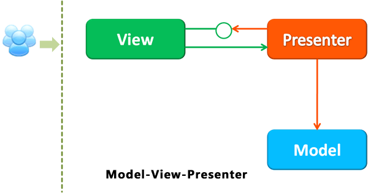
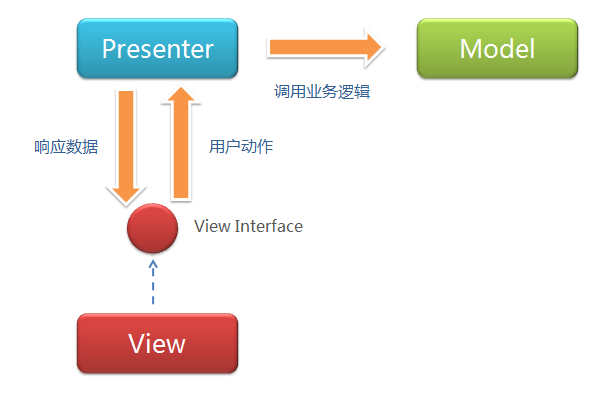

现在都讲究前端工程化，说的最多的是mvvm，但是之前一直不理解，今天系统的学习一些 

>  ## 观点学习来源[woodk](http://www.cnblogs.com/woodk/p/5125500.html)

在MVC里，View是可以直接访问Model的！从而，View里会包含Model信息，不可避免的还要包括一些业务逻辑。 MVC模型关注的是Model的不变，所以，在MVC模型里，Model不依赖于View，但是 View是依赖于Model的。不仅如此，因为有一些业务逻辑在View里实现了，导致要更改View也是比较困难的，至少那些业务逻辑是无法重用的。 

MVVM在概念上是真正将页面与数据逻辑分离的模式，它把数据绑定工作放到一个JS里去实现，而这个JS文件的主要功能是完成数据的绑定，即把model绑定到UI的元素上。 

有人做过测试：使用Angular（MVVM）代替Backbone（MVC）来开发，代码可以减少一半。 

此外，MVVM另一个重要特性，双向绑定。它更方便你同时维护页面上都依赖于某个字段的N个区域，而不用手动更新它们。 

> ## 观点学习来源[indream](http://www.cnblogs.com/indream/p/3602348.html)

### Model-View-Controller ###
在ASP还在奋斗的时候WebForm突然到来，正如WebForm还在奋斗的时候MVC突然到来。当然，我这里讲的MVC还是最原始的MVC，因为MVC在我们还在争论的时候已经发展了许多不同分支了。 

有一点相信大家同意的就是，我们今天讨论争论的MVC、MVP、MVVM、Code Behind等等都源自于职能分化和规划的思想与目的，MVC不是它们的开始，但是一个很好的开始。 

相信MVC的模型大家很熟悉，也很容易找到，我们可以看到的是，界面被分到了View，数据分到了载体Model上由Model“携带”，业务集中在Controller中，而推动业务的事件由用户与View交互，通过View向Controller发动。 

当然，实现由很多种，每种细节上都有不同，所以我才只讲也只能讲大致的MVC。MVC的其中一个缺点便是没有明确的定义，所以不同的实现（比如Struts和ASP.NET MVC）细节上都是不一样的。 

我们需要知道的是，MVC并不是像上面所说的一些事情那样是一种“必然的”结果，它是一系列必然结果问题中的一种解决方案，而且是不完美的解决方案。我们顺着推理去到一个地方很容易犯的一个错误就是认为路只有这一条而忽视其他可能性（估计这也是导致很多争斗的原因）。另外，我们在讨论一件事物不完美的时候是有一个情境的，所以请不要像“我说它色彩单一，然后你把它涂成彩色后证明我是错的”。 

MVC的一般流程是这样的：View（界面）触发事件--》Controller（业务）处理了业务，然后触发了数据更新--》不知道谁更新了Model的数据--》Model（带着数据）回到了View--》View更新数据 

### Model-View-Presenter和一些衍生 ###
像我们之前推理的，分化是一种需求的必然结果，但却没有个一个确定的结果，比如Code Behind和Code Block的问题等等。

MVC顺着需求把UI相关的工作分化成了三份，这点经过实践证明无可厚非。但是它们的三角关系却被一些人认为带来了一些问题，或者应该说他们有“更好的”解决方案。

在只有Code Behind和Code Block的那个时候维护是很直接的，不是在同一段代码内解决就是在同一个关联的事件上解决。三角关系的问题就是维护问题。在MVC，当你有变化的时候你需要同时维护三个对象和三个交互，这显然让事情复杂化了。

我们之前说到，随着摩尔定律，软件的需求不断地变化和变得庞大。随着需求变得庞大的时候，需求变化也变得频繁，这是一个出现了无数次以后也将会出现无数的无数次的一个问题，所以它需要一个解决方案，哪怕它不一定能被解决。

为了解决需求变化，从《人月神话》到敏捷到DDD，它不是我们已经解决了的问题，而是我们正在解决的问题。放在UI的模式和MVC上来讲，就是优化或者替代MVC模式，其中之一就是Model-View-Presenter（MVP）模式。

我们先看看两个MVP模式的图：

两幅图是不同的，但是对MVC的改进的思想却是一样的：切断的View和Model的联系，让View只和Presenter（原Controller）交互，减少在需求变化中需要维护的对象的数量。

这种方式很符合我们的期待，因为我们倾向于：

用更低的成本解决问题
用更容易理解的方式解决问题
许多时候并不是一种模式不好，而是因为人没办法执行，比如不容易理解，我们就会选择容易理解的方式。计算机依赖摩尔定律用数量的增长来解决问题，而人是用方式的改变来解决问题的。同样因为客观原因我们不善于维护多个对象和多个对象之间的关系，所以我们改变了，或者说简化了这种方式。

MVP定义了Presenter和View之间的接口，让一些可以根据已有的接口协议去各自分别独立开发，以此去解决界面需求变化频繁的问题。上面两图都有接口，不过接口的实现和使用细节不一样，不过思想上是一致的。

在这里要提到的是，事实上，需求变化最频繁的并不一定是最接近用户的界面，但基本可以确定的是，最接近用户的界面是因为需求变化而需要最频繁更改的。当然，如果View如果是API而不是UI，那就另说了。

还有一些用来“解决”MVC这项缺点的比如有：ASP.NET MVC的ViewBag，Cocoa的delegate。它们都为了简化数据更新的问题而存在，包括MVVM。

### MVVM ###

从图上看是比MVP简单了，更不用说MVC了。个人不认为MVVM是从MVP进化而来，我只觉得这是在MVP之后出现的一种“更好的”UI模式解决方案，但是用MVP来与之对比比较容易说明问题。

ViewModel大致上就是MVP的Presenter和MVC的Controller了，而View和ViewModel间没有了MVP的界面接口，而是直接交互，用数据“绑定”的形式让数据更新的事件不需要开发人员手动去编写特殊用例，而是自动地双向同步。数据绑定你可以认为是Observer模式或者是Publish/Subscribe模式，原理都是为了用一种统一的集中的方式实现频繁需要被实现的数据更新问题。

比起MVP，MVVM不仅简化了业务与界面的依赖关系，还优化了数据频繁更新的解决方案，甚至可以说提供了一种有效的解决模式。

至此，我们能理解为什么许多人认为MVVM是最好的一种模式，没有之一。但事实上，MVVM也是依赖于我们至今所讲的“特有的情境”。

当然，最优雅的也是第一个能作代表的实践就是Windows Presentation Foundation（WPF）了。

> ## 个人总结

我看了这些相关blog对于mvvm的评价大致都是比较中肯，在一定程度上能够提高开发效率，之前我比较熟悉的mvc模式中，m和v的关系过于紧密，导致如果想将现有版本移植到不同平台，会产生类似需要重构的结果，但是在mvvm中，m和v是没有什么关系的，vm可以自动同步的更新m和v，不需要重复写相关代码，手动去更新，这样可以提高代码的复用率，这样也提高了办事效率。
