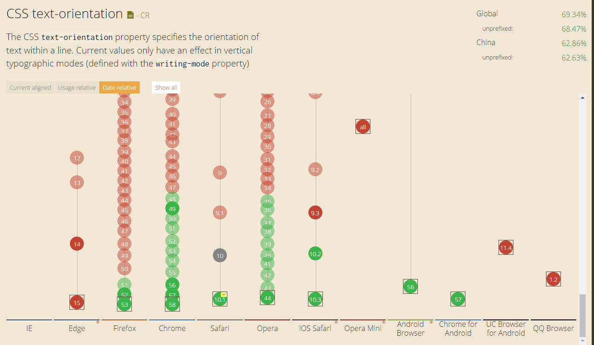

> 在上个月了解到css变量，懒惰如我，就没有好好看一下，只是惊讶了一下，今天想做一个皮肤切换的功能所以想到了这个，好好研究之后，希望能够极大提高渲染效率。[日常搬运](http://www.zhangxinxu.com/wordpress/2016/11/css-css3-variables-var/)

- # 1 现有浏览器支持情况

    
    Chrome/Firefox/Safari浏览器对于`cssvar`兼容性较为良好，我自己做的项目暂时不需要支持太多的低版本浏览器，也不认为我会去支持ie，结论可以上手了。

- # 2 CSS变量var()语法和用法和特性
  - ### 1 基础语法
    CSS中原生的变量定义语法是：--*，变量使用语法是：var(--*)，其中*表示我们的变量名称。关于命名这个东西，各种语言都有些显示，例如CSS选择器不能是数字开头，JS中的变量是不能直接数值的，但是，在CSS变量中，这些限制通通没有，例如：
    ```css
    :root {
      --1: #369;
    }
    body {
      background-color: var(--1);
    }
    ```

    #### 注：但是，不能包含$，[，^，(，%等字符，普通字符局限在只要是“数字[0-9]”“字母[a-zA-Z]”“下划线_”和“短横线-”这些组合，但是可以是中文，日文或者韩文，例如：
    ```css
    body {
      --深蓝: #369;
      background-color: var(--深蓝);
    }
    ```
    所以，我们就可以直接使用中文名称作为变量，即使英语4级没过的小伙伴也不会有压力了，我们也不需要随时挂个翻译器在身边了。  

    无论是变量的定义和使用只能在声明块{}里面，例如，下面这样是无效的：
    ```css
    --深蓝: #369;
    body {
      background-color: var(--深蓝);
    }
    ```
    变量的定义，或者说声明跟CSS计数器的声明类似的，你应该摆脱Sass/Less等预编译工具语法先入为主的语法影响，把CSS的原生变量理解为一种CSS属性。

    例如下面这个例子：

    ```css
    :root { --color: purple; }
    div { --color: green; }
    #alert { --color: red; }
    * { color: var(--color); }
    ```

    ```html
    <p>我的紫色继承于根元素</p>
    <div>我的绿色来自直接设置</div>
    <div id='alert'>
      ID选择器权重更高，因此阿拉是红色！
      <p>我也是红色，占了继承的光</p>
    </div>
    ```
    上面这个例子我们可以获得这些信息：

      变量也是跟着CSS选择器走的，如果变量所在的选择器和使用变量的元素没有交集，是没有效果的。例如#alert定义的变量，只有id为alert的元素才能享有。如果你想变量全局使用，则你可以设置在:root选择器上；
      当存在多个同样名称的变量时候，变量的覆盖规则由CSS选择器的权重决定的，但并无!important这种用法，因为没有必要，!important设计初衷是干掉JS的style设置，但对于变量的定义则没有这样的需求。
      CSS属性名可以走变量吗？

      类似下面这样：

      ```css
      body {
          --bc: background-color;    
          var(--bc): #369;
      }
      ```
      答案是“不可以”，要是可以支持的话，那CSS的压缩可就要逆天了，估计所有的属性都会变成1~2个字符，CSS变量不支持同时多个声明。

      CSS变量使用完整语法
      CSS变量使用的完整语法为：var( [, ]? )，用中文表示就是：var( <自定义属性名> [, <默认值 ]? )，

      意思就是，如果我们使用的变量没有定义（注意，仅限于没有定义），则使用后面的值作为元素的属性值。举个例子：

      ```css
        .box {
        --1: #369;
        }
        body {
        background-color: var(--1, #cd0000);
        }
      ```
      则此时的背景色是#cd0000

  - ### 2 CSS变量不合法的缺省特性

      请看下面这个例子：
      ```css
      body {
        --color: 20px;
        background-color: #369;
        background-color: var(--color, #cd0000);
      }
      ```
      上述`<body>`的背景色会是`transparent`,对于CSS变量，只要语法是正确的，就算变量里面的值是个乱七八糟的东西，也是会作为正常的声明解析，如果发现变量值是不合法的，例如上面背景色显然不能是20px，则使用背景色的缺省值，也就是默认值代替，于是，上面CSS等同于：
      ```css      
      body {
      --color: 20px;
      background-color: #369;
      background-color: transparent;
      }
      ```
      千万不能想当然得认为等同于`background-color:20px`，这也是为什么上面要强调CSS默认值的使用仅限于`变量未定义`的情况，并不包括`变量不合法`。

  - ### 3 CSS变量的空格尾随特性

      请看下面这个例子：
      ```css
      body {
        --size: 20;   
        font-size: var(--size)px;
      }
      ```
    实际上，此处font-size:var(--size)px等同于font-size:20 px，注意，20后面有个空格，所以，这里的font-size使用的是<body>元素默认的大小。因此，就不要妄图取消就使用一个数值来贯穿全场，还是使用稳妥的做法：
      ```css
      body {
        --size: 20px;   
        font-size: var(--size);
      }
      ```
      或者使用CSS3 calc()计算：
      ```css
      body {
        --size: 20;   
        font-size: calc(var(--size) * 1px);
      }
      ```
      此时，`<body>`的`font-size`大小才是`20px`，

  - ### 4 CSS变量的相互传递特性

      就是说，我们在CSS变量定义的时候可以直接引入其他变量给自己使用，例如：
      ```css
      body {
        --green: #4CAF50;   
        --backgroundColor: var(--green);
      }
      ```
      或者更复杂的使用CSS3 calc()计算，例如：
      ```css
      body {
        --columns: 4;
        --margins: calc(24px / var(--columns));
      }
      ```
      对于复杂布局，CSS变量的这种相互传递和直接引用特性可以简化我们的代码和实现成本，尤其和动态布局在一起的时候，无论是CSS的响应式后者是JS驱动的布局变化。

      随着浏览器宽度减小，demo中的4栏可能就变成3栏，2栏甚至1栏，实际开发的时候，显然不仅仅是栏目数量变化，宽度小，往往意味着访问设备尺寸有限，此时我们往往会缩小空白间距以及文字字号大小，这样，有限屏幕才能显示更多内容。

      也就是说，当我们响应式变化的时候，改变的CSS属性值不是1个，而是3个或者更多，如果我们有3个响应点，是不是就至少需要9个CSS声明？但是，由于我们有了CSS变量，同时，CSS变量可以传递，当我们遭遇响应点的时候，我们只需要改变一个CSS属性值就可以了。

      下面就是本demo核心CSS代码（只需要改变--columns这一个变量即可）：
      ```css
      .box {
          --columns: 4;
          --margins: calc(24px / var(--columns));
          --space: calc(4px * var(--columns));
          --fontSize: calc(20px - 4 / var(--columns));
      }
      @media screen and (max-width: 1200px) {
          .box {
              --columns: 3;
          }
      }
      @media screen and (max-width: 900px) {
          .box {
              --columns: 2;
          }
      }
      @media screen and (max-width: 600px) {
          .box {
              --columns: 1;
          }
      }
      ```
- # 3 整理思路
    css变量有`继承性`，`变量合法的缺省特性`，`空格尾随特性`，`内部传递特性`,特别是结合了`calc`之后，在页面布局这一块还是很有作用的，在响应式布局中，也可以不依赖外部样式进行布局，但是这边还没有看到我想要的效果，我希望能够一个css全局去传，但是我在js中之中也可以进行控制，做到切换皮肤的效果，没有看到，不知道这边应该怎样玩耍，没有思路，希望之后可以继续补充，还有今天还看了`count()`属性，似乎挺有用，但是想了一下，现在一般都是`json`串遍历，在遍历的过程中index索引是可以传递的，所以不知道这个在实际项目中的用处，不过，`content: counter(wangxiaoer, lower-roman);`、` counter-reset`、`counter-increment`这个我在去年好像就看过，结果到现在再看，还是感觉像看新的一样，捂脸.jpg。
