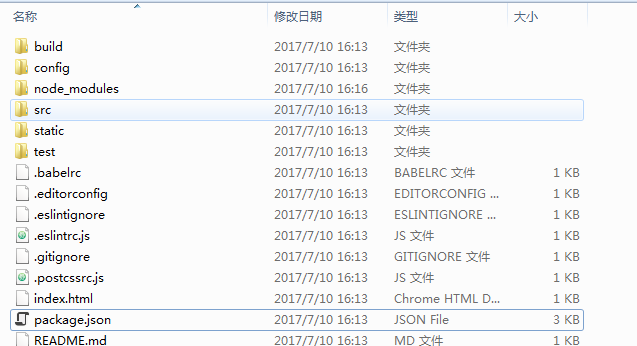

> 上周末学习了vue-elm，看相关的组件新建和使用，看了如何修改相关webpack，修改相关linter规则，感觉需要用项目来实战一些，之前看相关教学视频的时候，写了一个总结，今天按照总结一直不成功遇见了很多坑，所以在这里重新再总结一下。

- 一 设置环境变量
  - 1 `win+e`打开文件夹
  - 2 `计算机/属性/高级系统设置/高级/环境变量`
  - 3  在系统用户和当前用户下修改path变量，增加`node的安装路径\nodejs\node_global`
---

- 二 先全局安装vue-cli
  ```cmd
  npm install -g vue-cli
  ```
---

- 三 然后选择想要使用的目录，注意使用cd进入相关文件夹,注意是进入你想要新建项目的父级
  ```cmd
  //先进入demo所在盘
  Your environment has been set up for using Node.js 6.9.4 (x64) and npm.

  D:\Users\Administrator>F:
  F:> cd F:\documentbak\7_10\bak
  ```
---

- 四 错误示范

  ```cmd
  npm init webpack demo

  This utility will walk you through creating a package.json file.
  It only covers the most common items, and tries to guess sensible defaults.

  See `npm help json` for definitive documentation on these fields
  and exactly what they do.

  Use `npm install <pkg> --save` afterwards to install a package and
  save it as a dependency in the package.json file.

  Press ^C at any time to quit.
  name: (bak) vuedemo
  version: (1.0.0) 1.0.0
  description:  this a demo for webpack with vue family
  entry point: (index.js) index.js
  test command: npm run index
  git repository: nothing
  keywords: vue cli rounter  resources
  author: mowatermelon
  license: (ISC) MIT
  About to write to F:\documentbak\7_10\bak\package.json:

  {
    "name": "vuedemo",
    "version": "1.0.0",
    "description": " this a demo for webpack with vue family",
    "main": "index.js",
    "scripts": {
      "test": "npm run index"
    },
    "repository": {
      "type": "git",
      "url": "nothing"
    },
    "keywords": [
      "vue",
      "cli",
      "rounter",
      "resources"
    ],
    "author": "mowatermelon",
    "license": "MIT"
  }

  Is this ok? (yes) YES

  F:\documentbak\7_10\bak>
  ```
---

- 五 正确语句配置项目相关数据，大部分都默认，记得最后我们是webapp所以最后两项可以选择写no
```cmd
vue init webpack demo
Your environment has been set up for using Node.js 6.9.4 (x64) and npm.

D:\Users\Administrator>f:

F:\>cd F:\documentbak\7_15\bak

F:\documentbak\7_15\bak>vue init webpack demo

'git' �����ڲ����ⲿ���Ҳ���ǿ����еij���
�������ļ�
? Project name demo
? Project description a vue demo
? Author wu eva
? Vue build standalone
? Install vue-router? Yes
? Use ESLint to lint your code? Yes
? Pick an ESLint preset Standard
? Setup unit tests with Karma + Mocha? Yes
? Setup e2e tests with Nightwatch? Yes

   vue-cli · Generated "demo".

   To get started:

     cd demo
     npm install
     npm run dev

   Documentation can be found at https://vuejs-templates.github.io/webpack


F:\documentbak\7_15\bak>^A
```

---

- 六 打包项目
  ``` cmd
  cd demo #进入相关文件夹
  npm install #安装项目
  ```
---

- 七 监听端口，运行相关环境，查看页面效果
  ``` cmd
  npm run dev
  ```
---

- 八 开启了npm run dev命令以后，如何关闭或者退出。
  ```bash
  #按下ctrl+c

  #会显示
  终止批处理操作吗(Y/N)? y
  ```
---

- 九 开启node服务之后，如何停止
  ```bash
  #osx下
  pkill node
  #或者
  killall node


  sudo lsof -i:80   //列出80端口下的进程
  sudo kill -9 xxxx    // xxxx指的是进程的PID
  ```
